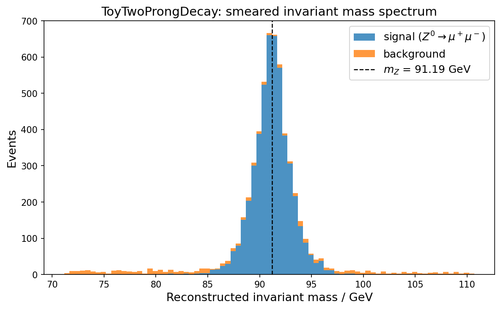

## ToyTwoProngDecay

`ToyTwoProngDecay` (`ttpd`) is a fast, lightweight simulator for two-prong
particle decays, designed for rapid prototyping of inference and unfolding
workflows in particle physics.

It ships a configurable factory interface that generates and smears paired
final-state kinematics for toy Monte Carlo studies, and integrates directly
with inference libraries such as [`sbi`](https://sbi-dev.github.io/sbi/).



The simulator is intentionally approximate: it targets method-development
studies (unfolding, simulation-based inference) rather than precision event
generation.

## Why this project exists

- fast iteration on toy Monte Carlo studies
- simple factory-based interface for configurable generators
- approximate detector smearing for downstream inference workflows
- drop-in simulator for `sbi` and related simulation-based inference tools

## Installation

`ToyTwoProngDecay` is not yet on PyPI.  Install it directly from GitHub:

With **pip**:

```bash
pip install git+https://github.com/Helmholtz-AI-Matter/ToyTwoProngDecay.git
```

With **uv**:

```bash
uv add git+https://github.com/Helmholtz-AI-Matter/ToyTwoProngDecay.git
```

## Quick start

```python
import torch

from ttpd.generator import SimulateFactory
from ttpd.kinematics import invariant_mass_from_ptphieta, mZ0

# build the simulator
factory = SimulateFactory.create(device=torch.device("cpu"))

# two events: one Z→μμ signal, one background
theta = torch.tensor([[mZ0, 0.0], [85.0, 1.0]])

# generate smeared decay products
events = factory.simulate(theta, generation_seed=123, smear_seed=321)

# compute reconstructed invariant masses  →  shape (2, 1)
masses = invariant_mass_from_ptphieta(events)
```

The `theta` tensor has two columns:

| column | meaning |
|--------|---------|
| `theta[:, 0]` | parent mass in GeV |
| `theta[:, 1]` | channel flag — `0` = signal, `1` = background |

## SBI example

`ToyTwoProngDecay` is designed to slot directly into
[`sbi`](https://sbi-dev.github.io/sbi/) workflows.
The snippet below shows the full loop: define a prior over the parent mass,
draw samples, run the simulator, and train a Neural Posterior Estimator (NPE).

```python
import torch
from sbi import utils as sbi_utils
from sbi.inference import NPE

from ttpd.generator import SimulateFactory
from ttpd.kinematics import invariant_mass_from_ptphieta, mZ0

# 1. Build the simulator -------------------------------------------------
factory = SimulateFactory.create(device=torch.device("cpu"))
_sim = factory.create_simulator(generation_seed=42, smear_seed=7)

# 2. Define a prior over the parent mass (signal channel, ±30 GeV) ------
prior = sbi_utils.BoxUniform(
    low=torch.tensor([mZ0 - 30.0]),
    high=torch.tensor([mZ0 + 30.0]),
)

# 3. Draw prior samples and simulate observations -----------------------
#    theta[:, 1] = 0 fixes the signal channel flag
def simulate(mass_theta: torch.Tensor) -> torch.Tensor:
    n = mass_theta.shape[0]
    theta = torch.hstack([mass_theta, torch.zeros(n, 1)])  # signal flag = 0
    return invariant_mass_from_ptphieta(_sim(theta))       # shape (n, 1)

theta_masses = prior.sample((2_000,))    # shape (2_000, 1)
x_obs = simulate(theta_masses)           # shape (2_000, 1)

# 4. Train an NPE posterior estimator -----------------------------------
inference = NPE(prior=prior)
inference.append_simulations(theta_masses, x_obs)
density_estimator = inference.train()
posterior = inference.build_posterior(density_estimator)

# 5. Sample the posterior given a target observation --------------------
target_mass = torch.tensor([[mZ0]])
target_obs = simulate(target_mass)
samples = posterior.sample((1_000,), x=target_obs)
```


